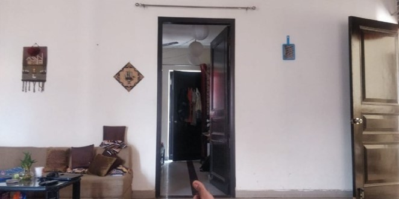

```markdown
# SAM Masking with Rainbow Patterns

This project demonstrates using the Segment Anything Model (SAM) to segment images and apply custom rainbow patterns to the segmented regions.

## Overview

The script loads an image, generates masks using SAM, and allows you to apply a wavy rainbow pattern to selected masks. 

### Example

1. **Original Image:**

   

2. **Selected Mask Region:**

   

3. **Processed Image with Rainbow Pattern:**

   )

## Requirements

- Python 3.x
- Libraries: `torch`, `opencv-python`, `Pillow`, `numpy`, `matplotlib`, `segment_anything`

Install required libraries with:

```bash
pip install torch opencv-python pillow numpy matplotlib
```

## License

This project is licensed under the MIT License. See the [LICENSE](LICENSE) file for details.

## Contact

For questions or feedback, email [rahulbasavaraj1@gmail.com](rahulbasavaraj1@gmail.com).
```

### Instructions

1. **Save images** in an `images` directory within your repository.
2. **Update image paths** in the README if necessary.
3. **Push changes** to your GitHub repository:

   ```bash
   git add README.md images/
   git commit -m "Add shortened README with images"
   git push
   ```
